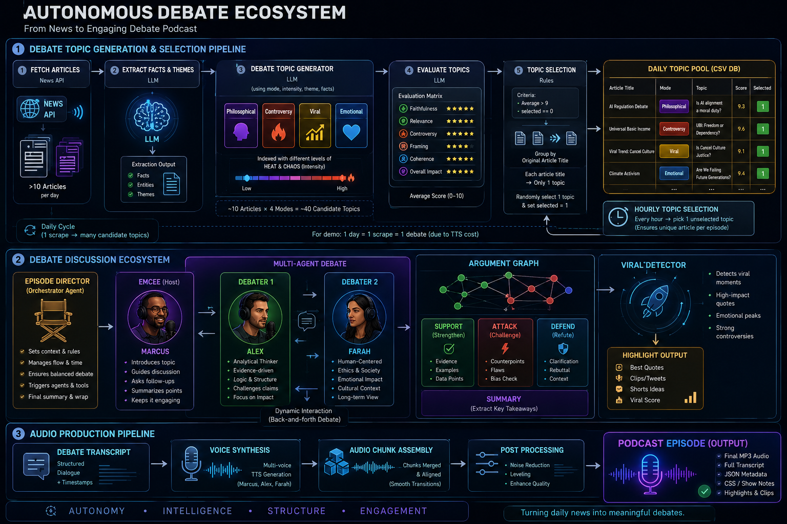

# Autonomous Debate Ecosystem

> An autonomous multi-agent ecosystem that transforms daily news into structured, debate-driven podcast episodes.

---

# Overview

The Autonomous Debate Ecosystem (ADE) is an AI-native editorial and podcast production framework designed to simulate the workflow of a real debate podcast.

demo link: https://infinite-debate.vercel.app

Rather than generating conversations directly, ADE models the complete production pipeline:

- Discover daily news.
- Extract factual knowledge.
- Generate multiple debate perspectives.
- Evaluate editorial quality.
- Select unique discussion topics.
- Direct multi-agent debates.
- Build structured argument flows.
- Detect viral moments.
- Produce fully voiced podcast episodes.

The project explores how autonomous AI agents can collaborate to perform the roles of researchers, editors, hosts, debaters, producers, and audio engineers.




---

# System Architecture

```
Daily News
    ↓
Editorial Intelligence
    ↓
AI Podcast Director
    ↓
Multi-Agent Debate
    ↓
Argument Intelligence
    ↓
Viral Intelligence
    ↓
Audio Production
    ↓
Podcast Episode
```

---

# Stage 1: Editorial Intelligence

The first stage discovers and prepares debate topics.

## News Collection

- Fetch >10 daily articles.
- Store article metadata.

```
News API
    ↓
Articles
```

---

## Fact Extraction

Each article is processed by an LLM to extract:

- Facts
- Entities
- Themes

```
Article
    ↓
LLM
    ↓
Facts
Entities
Themes
```

---

## Debate Topic Generation

Each article generates multiple possible debate angles.

### Modes

- Philosophical
- Controversial
- Viral
- Emotional

Each mode can be adjusted using:

- Heat
- Chaos
- Intensity

Input:

```
Facts
Entities
Themes
Mode
Intensity
```

Output:

```
~10 Articles
×

4 Modes

=

~40 Candidate Debates
```

---

## Topic Evaluation

Every candidate debate is evaluated using:

- Original article
- Extracted facts
- Debate topic

Scoring dimensions:


| Metric       | Description              |
| ------------ | ------------------------ |
| Faithfulness | Consistency with source  |
| Relevance    | Importance of discussion |
| Controversy  | Potential disagreement   |
| Framing      | Quality of debate setup  |
| Coherence    | Logical structure        |
| Overall      | Aggregate quality        |


Average scores are calculated for each candidate.

---

## Topic Selection

Selection rules:

```
average > 9

selected == 0
```

Group by original article title.

Each article can only contribute one debate topic.

One candidate is randomly selected and marked as used.

This allows multiple unique debate episodes to be generated from a single daily news cycle while preventing repetition.

For demonstration purposes:

```
1 Scraper
↓

1 Debate

↓

1 Podcast Episode
```

This constraint exists primarily because of voice synthesis costs.

---

# Stage 2: AI Podcast Director

The AI Podcast Director coordinates episode flow.

Responsibilities:

- Set episode context.
- Control pacing.
- Balance speaker participation.
- Manage transitions.
- Maintain discussion quality.

The director acts as the orchestrator of the debate.

---

# Stage 3: Multi-Agent Debate

Three agents participate.

## Marcus

Host and moderator.

Responsibilities:

- Introduce topic.
- Guide discussion.
- Ask follow-up questions.
- Summarize arguments.

---

## Alex

Analytical debater.

Focus:

- Logic
- Evidence
- Practical consequences

---

## Farah

Human-centered debater.

Focus:

- Ethics
- Society
- Emotional impact
- Cultural implications

---

# Argument Intelligence

The debate is represented as an evolving argument graph.

```
Claim
├── Support
├── Attack
└── Summary
```

This structure enables:

- Better conversational memory.
- Reduced repetition.
- Stronger debate coherence.
- Easier post-processing.

---

# Viral Intelligence

The system identifies high-impact moments.

Potential signals include:

- Strong disagreements.
- Emotional peaks.
- Memorable quotes.
- Unexpected perspectives.
- High-engagement exchanges.

These moments can later support:

- Episode highlights.
- Shorts.
- Social media clips.
- Viral scoring.

---

# Stage 4: Audio Production

The completed debate enters the production pipeline.

```
Transcript
    ↓
Voice Synthesis
    ↓
Audio Chunk Generation
    ↓
Audio Assembly
    ↓
Podcast Episode
```

Outputs include:

- MP3 audio
- Transcript
- JSON metadata
- CSS styling
- Episode assets

---

# Design Philosophy

The Autonomous Debate Ecosystem follows several principles.

## Editorial before generation.

Topics should be curated, not randomly invented.

## Debate before narration.

Conversations are more engaging than summaries.

## Structure before improvisation.

Argument graphs maintain logical consistency.

## Multiple perspectives.

Different agents provide competing viewpoints.

## Automation with autonomy.

Independent AI components collaborate to produce a complete debate podcast.

---

# Local Development Setup 
### 1. Configure Environment Variables
```bash
cd backend
cp .env.example .env
# Edit .env and set relavant content
```
### 2. backend
```bash
cd backend
npm install
npm run dev # provide api for frontend to display audio

npm run scraper # to scrap and generated multiple news debate topic
npm run programme # to generate debate conversation and audio
npm run generate # run scrap and generate 1 topic for debate conversation and audio

```
### 3. frontend
In new terminal do backend set up:
```bash
cd frontend
npm install
npm run dev
```


---

# Vision

The Autonomous Debate Ecosystem explores the idea that podcast production can become an autonomous editorial process.

Instead of simply generating text or speech, the system coordinates specialized AI agents that perform the roles of journalists, editors, moderators, debaters, producers, and audio engineers.

The result is a fully automated pipeline capable of transforming daily news into structured, engaging, and debate-driven podcast episodes.