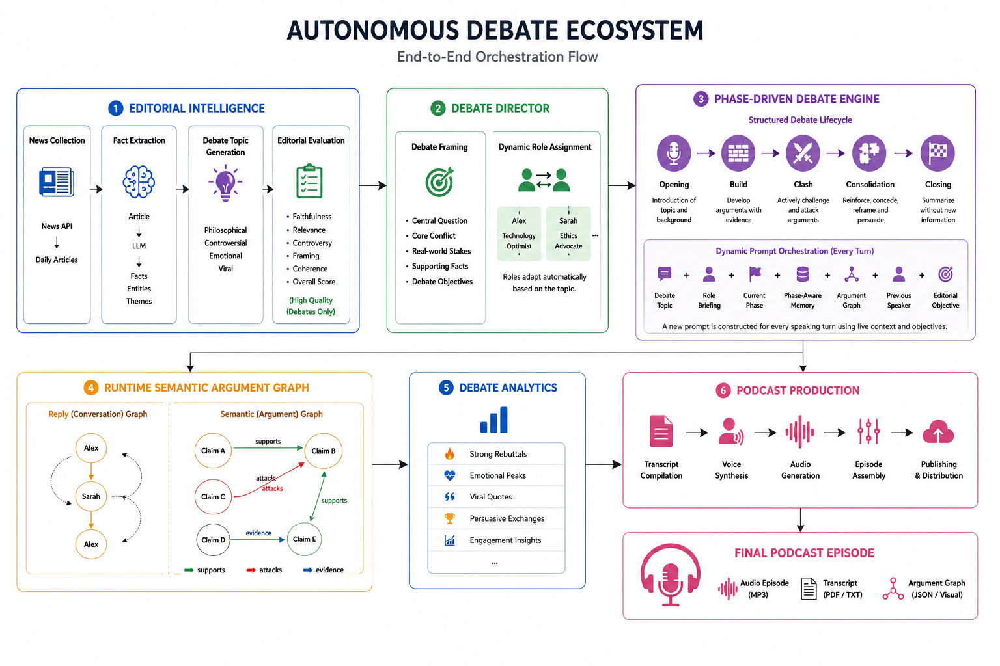

# Autonomous Debate Ecosystem

> An autonomous multi-agent ecosystem that transforms daily news into structured, phase-driven debates and fully narrated podcast episodes.

---

# Overview

The **Autonomous Debate Ecosystem (ADE)** is an AI-native editorial framework that simulates the workflow of a professional debate podcast.

Instead of generating a conversation from a single prompt, ADE coordinates multiple specialized AI agents that perform the roles of researchers, editors, moderators, debaters, producers, and audio engineers.

Demo link: https://infinite-debate.vercel.app

Every episode follows a complete production pipeline:

```
Daily News
      ↓
Editorial Intelligence
      ↓
Debate Director
      ↓
Phase-Driven Multi-Agent Debate
      ↓
Semantic Argument Graph
      ↓
Debate Analytics
      ↓
Voice Production
      ↓
Podcast Episode
```

The result is a structured debate that maintains logical consistency, adapts strategically throughout the discussion, and can be inspected through an interactive argument graph.



---

# Key Features

* 📰 Automated daily news discovery and topic generation
* 🧠 AI editorial evaluation and debate selection
* 🎭 Dynamic role assignment based on each debate topic
* 🎙 Phase-driven multi-agent debate orchestration
* 🕸 Runtime semantic argument graph
* 📈 Interactive visualization of debate flow
* 🔍 Semantic relationship detection between arguments
* 🎧 Automated voice synthesis and podcast production

---

# System Architecture

```
                    Daily News
                         │
                         ▼
               Editorial Intelligence
                         │
                         ▼
                  Debate Director
                         │
                         ▼
               Phase-Driven Debate Engine
                         │
        ┌────────────────┴────────────────┐
        ▼                                 ▼
Semantic Argument Graph          Debate Analytics
        │                                 │
        └────────────────┬────────────────┘
                         ▼
                Podcast Production
                         │
                         ▼
                   Podcast Episode
```

---

# Stage 1 — Editorial Intelligence

ADE begins by discovering current news articles and transforming them into potential debate topics.

## News Collection

```
News API
      ↓
Daily Articles
```

Each article is stored together with its metadata for later processing.

---

## Fact Extraction

Every article is analyzed by an LLM to extract structured knowledge.

```
Article
      ↓
LLM
      ↓
Facts
Entities
Themes
```

These facts become the factual foundation of the debate.

---

## Debate Topic Generation

Each article produces multiple candidate debate topics across several editorial styles.

```
Facts
Entities
Themes
        ↓

Philosophical
Controversial
Emotional
Viral
```

Each mode can be tuned through configurable creativity parameters.

---

## Editorial Evaluation

Every generated debate is evaluated before it is allowed into the production pipeline.

Evaluation metrics include:

| Metric       | Purpose                 |
| ------------ | ----------------------- |
| Faithfulness | Matches source material |
| Relevance    | Discussion value        |
| Controversy  | Potential disagreement  |
| Framing      | Debate quality          |
| Coherence    | Logical consistency     |
| Overall      | Final editorial score   |

Only high-quality debates proceed to production.

---

# Stage 2 — Debate Director

Before the debate begins, an AI Debate Director prepares the entire discussion.

Instead of giving every participant a fixed personality, the director generates topic-specific strategic briefings.

For each debate it creates:

* Central question
* Core conflict
* Real-world stakes
* Supporting facts
* Debate objectives

The director also assigns dynamic roles to every participant.

Example:

```
Alex
↓

Technology Optimist

Sarah
↓

Ethics Advocate

```

Roles change automatically depending on the selected topic.

---

# Stage 3 — Phase-Driven Debate Engine

Unlike traditional chatbot conversations, every debate follows a structured lifecycle inspired by competitive debates.

```
Opening
      ↓
Build
      ↓
Clash
      ↓
Consolidation
      ↓
Closing
```

Each phase has different objectives, prompting strategies, and available reasoning tools.

## Opening

Emcee introduce the debate topic and background.

---

## Build

Each debater develops independent arguments supported by evidence and predefined strategic objectives.

The prompt emphasizes:

* Opening strategy
* Core claims
* Known facts

---

## Clash

Participants actively challenge each other's strongest arguments.

The prompt dynamically shifts toward:

* Attack vectors
* Reframing techniques
* Identified weaknesses

Instead of merely continuing the conversation, agents are instructed to directly engage with opposing claims.

---

## Consolidation

The debate transitions from conflict toward persuasion.

Participants:

* Reinforce their strongest arguments
* Strategically acknowledge concessions
* Reframe earlier discussion
* Prepare their final narrative

---

## Closing

The final phase focuses on summarization rather than introducing new information.

Agents are instructed to synthesize the discussion using only arguments that have already appeared during the debate.

This prevents the common LLM behavior of introducing entirely new evidence at the end of a discussion.

---

# Dynamic Prompt Orchestration

Rather than relying on a single static prompt, ADE constructs a new prompt for every speaking turn based on the current debate state.

Each prompt combines multiple layers of contextual information.

```text
Debate Topic
        +
Role Briefing
        +
Current Debate Phase
        +
Phase-Aware Memory
        +
Argument Graph
        +
Previous Speaker
        +
Current Editorial Objective
```

This allows every participant to adapt their reasoning as the debate progresses instead of following a fixed prompt throughout the entire discussion.

---

## Phase-Aware Memory

Instead of continuously supplying the full conversation history, ADE dynamically adjusts the amount of memory provided to each participant based on the current debate phase and speaking role.

This reduces unnecessary context while encouraging more natural debate progression.

| Phase         | Memory Strategy                                                                                                                                                                                                    |
| ------------- | ------------------------------------------------------------------------------------------------------------------------------------------------------------------------------------------------------------------ |
| Opening       | No conversation memory. Participants establish independent positions.                                                                                                                                              |
| Build         | No conversation memory. Debaters focus on presenting their own arguments without early influence from opponents.                                                                                                   |
| Clash         | Debaters receive only the most recent opponent response to encourage direct rebuttals. The moderator receives the complete debate history to guide the discussion.                                                 |
| Consolidation | Debaters receive the complete debate history to strengthen their strongest arguments and prepare their final narrative. The moderator receives no memory because their responsibility is to transition the debate. |
| Closing       | Debaters receive only their own previous statements, preventing new arguments while encouraging consistent final summaries. The moderator receives the full debate history to deliver an overall conclusion.       |

---

## Why Not Use Full Conversation History?

Providing the entire transcript at every turn often leads to undesirable LLM behaviors, including:

* repetitive arguments
* unnecessary self-reference
* reduced focus on the current objective
* excessive prompt length
* higher inference cost

Instead, ADE deliberately controls how much historical information is exposed throughout the debate lifecycle.

This creates a balance between conversational consistency and strategic progression.

---

# Runtime Semantic Argument Graph

Every speaking turn becomes a node inside a growing semantic graph.

```
Node
├── Speaker
├── Phase
├── Claims
├── Embedding
├── Reply Relationships
├── Semantic Relationships
└── Runtime Metrics
```

Two independent graph structures are maintained simultaneously.

## Reply Graph

Tracks conversational flow.

```
Alex
   │
   ▼
Sarah
   │
   ▼
Alex
```

---

## Semantic Graph

Tracks logical relationships between arguments.

Examples include:

* Supports
* Attack
* Evidence
* Concession
* Same Theme
* None

```
Claim A
   │
supports
   ▼
Claim B

Claim C
   │
Attack
   ▼
Claim B
```

This allows the debate to be analyzed based on meaning rather than chronological order.

---

# Interactive Debate Visualization

The runtime graph can be explored through an interactive visual interface.

Users can inspect:

* Debate phases
* Reply chains
* Semantic relationships
* Argument evolution
* Runtime metadata
* Node connections

This makes the internal reasoning process transparent rather than treating the debate as an opaque text transcript.

---

# Debate Analytics

The completed debate is analyzed to identify high-impact moments.

Signals include:

* Strong rebuttals
* Emotional peaks
* Viral quotes
* High-confidence semantic relationships
* Persuasive exchanges

These analytics can later support:

* Podcast highlights
* Short-form clips
* Social media content
* Debate summaries

---

# Podcast Production

After the debate concludes, the transcript enters the production pipeline.

```
Transcript
      ↓
Voice Synthesis
      ↓
Audio Generation
      ↓
Episode Assembly
      ↓
Podcast
```

Outputs include:

* Podcast audio
* Transcript
* Structured debate graph
* Runtime metadata

---

# Design Philosophy

ADE follows five core principles.

### Editorial before generation

Topics should be curated rather than randomly invented.

### Structure before improvisation

Debates follow explicit phases with evolving objectives.

### Semantics before chronology

Arguments are connected by meaning, not only by speaking order.

### Transparency before black boxes

Every debate can be inspected through a runtime graph.

### Autonomous collaboration

Specialized AI agents cooperate to produce a complete debate experience.

---

# Future Research

This project serves as a foundation for future experimentation in autonomous multi-agent reasoning.

Potential research directions include:

* Retrieval-augmented evidence generation
* Automatic fact verification
* Logical fallacy detection
* Argument strength prediction
* Debate outcome prediction
* Multi-agent consensus strategies
* Knowledge graph integration
* Long-term conversational memory

---
# Local Development Setup 
### 1. Configure Environment Variables
```bash
cd backend
cp .env.example .env
# Edit .env and set relavant content
```
### 2. backend
```bash
cd backend
npm install
npm run dev # provide api for frontend to display audio

npm run scraper # to scrap and generated multiple news debate topic
npm run programme # to generate debate conversation and audio
npm run generate # run scrap and generate 1 topic for debate conversation and audio

```
### 3. frontend
In new terminal do backend set up:
```bash
cd frontend
npm install
npm run dev
```

---

