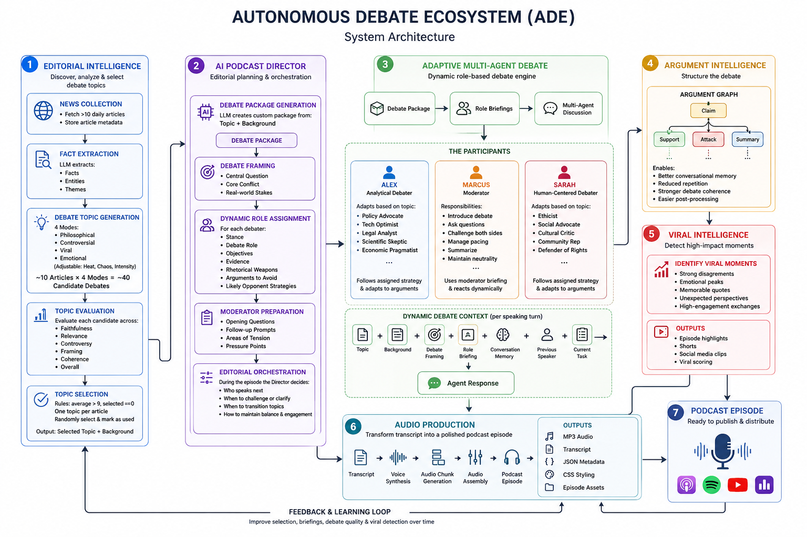

# Autonomous Debate Ecosystem

> An autonomous multi-agent ecosystem that transforms daily news into structured, debate-driven podcast episodes.

---

# Overview

The Autonomous Debate Ecosystem (ADE) is an AI-native editorial and podcast production framework designed to simulate the workflow of a real debate podcast.

demo link: https://infinite-debate.vercel.app

Rather than generating conversations directly, ADE models the complete production pipeline:

- Discover daily news.
- Extract factual knowledge.
- Generate multiple debate perspectives.
- Evaluate editorial quality.
- Select unique discussion topics.
- Direct multi-agent debates.
- Build structured argument flows.
- Detect viral moments.
- Produce fully voiced podcast episodes.

The project explores how autonomous AI agents can collaborate to perform the roles of researchers, editors, hosts, debaters, producers, and audio engineers.




---

# System Architecture

```
Daily News
    ↓
Editorial Intelligence
    ↓
AI Podcast Director
    ↓
Multi-Agent Debate
    ↓
Argument Intelligence
    ↓
Viral Intelligence
    ↓
Audio Production
    ↓
Podcast Episode
```

---

# Stage 1: Editorial Intelligence

The first stage discovers and prepares debate topics.

## News Collection

- Fetch >10 daily articles.
- Store article metadata.

```
News API
    ↓
Articles
```

---

## Fact Extraction

Each article is processed by an LLM to extract:

- Facts
- Entities
- Themes

```
Article
    ↓
LLM
    ↓
Facts
Entities
Themes
```

---

## Debate Topic Generation

Each article generates multiple possible debate angles.

### Modes

- Philosophical
- Controversial
- Viral
- Emotional

Each mode can be adjusted using:

- Heat
- Chaos
- Intensity

Input:

```
Facts
Entities
Themes
Mode
Intensity
```

Output:

```
~10 Articles
×

4 Modes

=

~40 Candidate Debates
```

---

## Topic Evaluation

Every candidate debate is evaluated using:

- Original article
- Extracted facts
- Debate topic

Scoring dimensions:


| Metric       | Description              |
| ------------ | ------------------------ |
| Faithfulness | Consistency with source  |
| Relevance    | Importance of discussion |
| Controversy  | Potential disagreement   |
| Framing      | Quality of debate setup  |
| Coherence    | Logical structure        |
| Overall      | Aggregate quality        |


Average scores are calculated for each candidate.

---

## Topic Selection

Selection rules:

```
average > 9

selected == 0
```

Group by original article title.

Each article can only contribute one debate topic.

One candidate is randomly selected and marked as used.

This allows multiple unique debate episodes to be generated from a single daily news cycle while preventing repetition.

For demonstration purposes:

```
1 Scraper
    ↓
1 Debate
    ↓
1 Podcast Episode
```

This constraint exists primarily because of voice synthesis costs.

---

# Stage 2: AI Podcast Director

The AI Podcast Director is responsible for transforming a news topic into a structured debate experience.

Rather than simply coordinating speaker turns, the director performs editorial planning before the discussion begins.

## Debate Package Generation

For every episode, an LLM creates a custom debate package based on the selected topic and its factual background.

The package defines:

```
Topic + Background
      ↓
Debate Package
```

The generated package contains:

### Debate Framing

* Central question
* Core conflict
* Real-world stakes

Example:

```
Should AI-generated content replace human creativity?

Central Question:
Can AI democratize creativity without harming artists?

Key Conflict:
Innovation vs creative ownership.

Stakes:
Economic, cultural, and ethical consequences.
```

---

## Dynamic Role Assignment

Instead of fixed personalities, each participant receives a topic-specific briefing.

Each debater is assigned:

* A stance
* A debate role
* Strategic objectives
* Supporting evidence
* Preferred rhetorical techniques
* Arguments to avoid
* Likely opponent strategies

For example:

```
Alex
↓
Defend technological progress

Sarah
↓
Defend human and cultural values
```

The exact positions change depending on the debate topic.

---

## Moderator Preparation

The moderator also receives a private briefing.

This includes:

* Opening questions
* Follow-up prompts
* Areas of tension
* Pressure points for both sides

The moderator uses these signals to maintain pacing and encourage deeper discussion.

---

## Editorial Orchestration

During the episode, the Podcast Director continuously evaluates debate state and decides:

* Who should speak next.
* Whether clarification is needed.
* When to challenge weak arguments.
* When to transition topics.
* How to maintain balance and engagement.

The director acts as the producer of the debate rather than as a participant.

---

# Stage 3: Adaptive Multi-Agent Debate

The debate itself is performed by multiple autonomous agents.

Unlike traditional role-playing systems, speaker identities are not permanently fixed.

Each episode generates new strategic briefings tailored to the selected topic.

```
Debate Package
        ↓
Role Briefings
        ↓
Multi-Agent Discussion
```

---

## Alex

Alex typically approaches problems from an analytical perspective.

Depending on the debate package, Alex may become:

* A policy advocate
* A technology optimist
* A legal analyst
* A scientific skeptic
* An economic pragmatist

Alex follows the assigned strategy while adapting to new arguments during the discussion.

---

## Sarah

Sarah generally represents human-centered perspectives.

Depending on the topic, Sarah may become:

* An ethicist
* A social advocate
* A cultural critic
* A community representative
* A defender of individual rights

Her objectives are dynamically generated for every episode.

---

## Marcus

Marcus serves as moderator.

Rather than following a scripted sequence, Marcus receives editorial guidance and reacts to the evolving conversation.

Responsibilities include:

* Introducing the debate.
* Asking prepared and spontaneous questions.
* Challenging both sides.
* Managing pacing.
* Summarizing key disagreements.
* Maintaining neutrality.

---

## Dynamic Debate Context

Every speaking turn is generated using multiple context layers:

```
Topic + Background + Debate Framing + Role Briefing + 
Conversation Memory + Previous Speaker + Current Task
                        ↓
                Agent Response
```

This allows participants to:

* Stay consistent with their assigned roles.
* Reference previous arguments.
* Adapt to strong counterpoints.
* Maintain long-form coherence.
* Avoid repetitive exchanges.

The result is a debate where strategies are generated for each episode rather than hardcoded into the system.

# Argument Intelligence

The debate is represented as an evolving argument graph.

```
Claim
├── Support
├── Attack
└── Summary
```

This structure enables:

- Better conversational memory.
- Reduced repetition.
- Stronger debate coherence.
- Easier post-processing.

---

# Viral Intelligence

The system identifies high-impact moments.

Potential signals include:

- Strong disagreements.
- Emotional peaks.
- Memorable quotes.
- Unexpected perspectives.
- High-engagement exchanges.

These moments can later support:

- Episode highlights.
- Shorts.
- Social media clips.
- Viral scoring.

---

# Stage 4: Audio Production

The completed debate enters the production pipeline.

```
Transcript
    ↓
Voice Synthesis
    ↓
Audio Chunk Generation
    ↓
Audio Assembly
    ↓
Podcast Episode
```

Outputs include:

- MP3 audio
- Transcript
- JSON metadata
- CSS styling
- Episode assets

---

# Design Philosophy

The Autonomous Debate Ecosystem follows several principles.

## Editorial before generation.

Topics should be curated, not randomly invented.

## Debate before narration.

Conversations are more engaging than summaries.

## Structure before improvisation.

Argument graphs maintain logical consistency.

## Multiple perspectives.

Different agents provide competing viewpoints.

## Automation with autonomy.

Independent AI components collaborate to produce a complete debate podcast.

---

# Local Development Setup 
### 1. Configure Environment Variables
```bash
cd backend
cp .env.example .env
# Edit .env and set relavant content
```
### 2. backend
```bash
cd backend
npm install
npm run dev # provide api for frontend to display audio

npm run scraper # to scrap and generated multiple news debate topic
npm run programme # to generate debate conversation and audio
npm run generate # run scrap and generate 1 topic for debate conversation and audio

```
### 3. frontend
In new terminal do backend set up:
```bash
cd frontend
npm install
npm run dev
```


---

# Vision

The Autonomous Debate Ecosystem explores the idea that podcast production can become an autonomous editorial process.

Instead of simply generating text or speech, the system coordinates specialized AI agents that perform the roles of journalists, editors, moderators, debaters, producers, and audio engineers.

The result is a fully automated pipeline capable of transforming daily news into structured, engaging, and debate-driven podcast episodes.